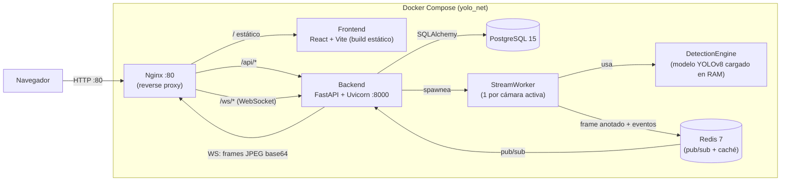

# YOLO Surveillance Platform

Plataforma web de videovigilancia inteligente con detección de objetos en tiempo real usando **YOLOv8 de Ultralytics**. Corre completamente dockerizada en local — no requiere GPU ni cuenta cloud para probarla.

## Características

- Detección de objetos en tiempo real con YOLOv8 (selección automática del modelo según hardware, con soporte opcional de GPU NVIDIA)
- Soporte de múltiples fuentes: cámaras IP vía RTSP, videos subidos, imágenes subidas
- Hasta 2 fuentes RTSP/video activas simultáneas (consumen inferencia continua); fuentes tipo imagen **sin límite** — se procesan una sola vez y se muestran en un mosaico dinámico en Live
- Bounding boxes con **color distinto por clase detectada** (mismo esquema de color en backend y frontend)
- Pausa automática de la inferencia de fuentes tipo video cuando nadie está viendo `/live` (ahorra CPU/GPU y evita eventos duplicados en cada vuelta del loop)
- Zonas ROI (Region of Interest) configurables por cámara
- Captura y almacenamiento de eventos con snapshots
- Exportación de eventos a **PDF** (incluye gráfico) y **Excel** desde `/events`
- Clasificación configurable: 80 clases COCO con perfiles predefinidos y opción "Seleccionar todas"
- Gestión de usuarios con roles (Admin, Operator, Viewer)
- Dashboard en tiempo real vía WebSockets
- Modales de confirmación para acciones destructivas (eliminar cámaras, usuarios, perfiles, eventos)
- Tema Dark/Light persistido por usuario, con paleta de color diferenciada por sección

## Arquitectura

Todo corre en contenedores Docker sobre una misma red interna (`yolo_net`); **Nginx es el único servicio expuesto al host** (puerto 80) y hace de reverse proxy hacia el frontend y el backend.



**Flujo de detección** (por cada fuente activa):
1. Al activar una cámara, el backend lanza un `StreamWorker` dedicado. Para RTSP/video corre en loop continuo leyendo frames; para imágenes procesa el archivo **una sola vez**.
2. Cada frame procesado pasa por el modelo YOLOv8 cargado en memoria (`DetectionEngine`, singleton compartido por todos los workers).
3. El frame anotado (con bounding boxes) se publica en Redis (`camera:{id}:frames`) y también se cachea en memoria — así el WebSocket puede mostrar algo de inmediato aunque el cliente se conecte después de que el frame se procesó (relevante para fuentes tipo imagen).
4. Si hay detecciones sobre el umbral configurado, se guarda un `Event` en PostgreSQL con snapshot en disco, y se publica también por Redis para actualizar la UI de Eventos en vivo.
5. El navegador consume los canales de Redis a través de un WebSocket que Nginx proxea hacia el backend (`/ws/camera/{id}/stream`, `/ws/camera/{id}/events`, `/ws/events`).

Por qué el límite de 2 fuentes activas aplica solo a RTSP/video: son las que corren un loop de inferencia continuo (consumo de CPU constante). Las imágenes se procesan una vez y no tienen costo de CPU sostenido, por eso no cuentan para el límite.

## Stack Tecnológico

| Capa | Tecnología |
|------|-----------|
| Backend | Python 3.11, FastAPI, YOLOv8 (Ultralytics), OpenCV headless, SQLAlchemy, Alembic |
| Base de Datos | PostgreSQL 15, Redis 7 |
| Frontend | React 18, Vite, TypeScript, Tailwind CSS, shadcn/ui, Zustand |
| Infra | Docker Compose, Nginx (reverse proxy) |

## Selección Automática de Modelo YOLO

Al arrancar, el sistema detecta el hardware disponible:

| Hardware | Modelo |
|----------|--------|
| GPU NVIDIA (CUDA) | `yolov8m.pt` (balance precisión/velocidad) |
| CPU, RAM ≥ 16 GB | `yolov8s.pt` (velocidad aceptable) |
| CPU, RAM < 16 GB | `yolov8n.pt` (nano, máxima velocidad) |

El modelo puede cambiarse manualmente desde `/settings` (Admin) sin reiniciar el contenedor (`POST /api/settings/reload-engine`).

### Aceleración por GPU (opcional)

Por defecto, Docker **no** le da acceso al contenedor a una GPU NVIDIA del host aunque exista — hay que habilitarlo explícitamente. El paquete `torch` ya instalado incluye soporte CUDA (`torch==2.3.0+cu121`), así que no hace falta cambiar nada del código: basta con pasarle el device al contenedor.

```bash
# En vez de "docker compose up", usar el override docker-compose.gpu.yml:
docker compose -f docker-compose.yml -f docker-compose.gpu.yml up --build -d
```

Requisitos en el host:
- Drivers NVIDIA instalados
- **Windows**: Docker Desktop con backend WSL2 (el soporte de GPU viene incluido, no requiere instalar nada extra)
- **Linux**: [NVIDIA Container Toolkit](https://docs.nvidia.com/datacenter/cloud-native/container-toolkit/latest/install-guide.html)

Verificar que el contenedor ve la GPU:
```bash
docker compose exec backend python -c "import torch; print(torch.cuda.is_available(), torch.cuda.get_device_name(0))"
```

Si ya tenías el backend corriendo sin GPU, tras aplicar el override hace falta recargar el motor para que detecte el nuevo hardware y cambie a `yolov8m.pt`: botón "Recargar motor de detección" en `/settings`, o `POST /api/settings/reload-engine`.

Sin este override, el proyecto sigue funcionando igual en cualquier máquina sin NVIDIA (CPU o GPU integrada) — es aditivo, no reemplaza el `docker-compose.yml` base.

## Requisitos Previos

- [Docker Desktop](https://www.docker.com/products/docker-desktop/) instalado y corriendo (incluye Docker Compose v2)
- Puerto **80** libre en el host (es el único puerto que se publica; Postgres/Redis/backend quedan solo en la red interna de Docker)
- ~4 GB RAM disponibles para los contenedores, más lo que pida el modelo YOLO elegido
- Conexión a internet en el primer arranque (para descargar las imágenes base de Docker y el modelo YOLO)

## Instalación y Arranque

```bash
# 1. Clonar el repositorio
git clone https://github.com/chris2009/OR_Plataform.git
cd OR_Plataform

# 2. Copiar la plantilla de variables de entorno
cp .env.example .env

# 3. Generar claves reales (OBLIGATORIO — la plantilla trae placeholders
#    que NO son válidos y hacen crashear al backend si no se reemplazan)
python -c "import secrets; print('SECRET_KEY=' + secrets.token_hex(32))"
python -c "import base64, os; print('FERNET_KEY=' + base64.urlsafe_b64encode(os.urandom(32)).decode())"
#    Copia ambos valores generados dentro de tu .env, reemplazando las
#    líneas SECRET_KEY= y FERNET_KEY= (no cambies el resto del archivo).

# 4. Levantar todos los servicios
docker compose up --build -d

# 5. Ver el progreso hasta que el backend termine de arrancar
#    (~2-3 min la primera vez: build de imágenes + descarga del modelo YOLO)
docker compose logs -f backend
#    Cuando veas "Application startup complete." ya está listo (Ctrl+C para salir del log)
```

> ⚠️ Si saltas el paso 3, el backend arranca pero **crashea en cuanto alguien intenta cifrar una contraseña de cámara** (`FERNET_KEY` inválido). No es opcional pese a que el `.env.example` lo sugiere como plantilla editable.

### Verificar que levantó bien

```bash
docker compose ps          # los 5 servicios deben estar "Up" (db y redis además "healthy")
curl -I http://localhost   # debe responder 200
```

Luego entra a `http://localhost` en el navegador e inicia sesión con las credenciales por defecto (abajo).

## Acceso

| Servicio | URL |
|----------|-----|
| Frontend | http://localhost |
| API REST | http://localhost/api |
| API Docs (Swagger) | http://localhost/api/docs |
| API Docs (ReDoc) | http://localhost/api/redoc |

**Credenciales por defecto:**
- Usuario: `admin`
- Contraseña: `admin123`

> Cambiar la contraseña del admin tras el primer login (`/settings` o `PUT /api/auth/me`).

## Estructura del Proyecto

```
Object_Recognition_Plataforma/
├── backend/                  # FastAPI + Python
│   ├── app/
│   │   ├── api/              # Routers REST + WebSockets
│   │   ├── core/             # Config (pydantic-settings), JWT, seguridad, Fernet
│   │   ├── db/                # Sesión SQLAlchemy async
│   │   ├── models/           # SQLAlchemy ORM
│   │   ├── schemas/          # Pydantic schemas
│   │   └── services/
│   │       └── detection/    # DetectionEngine (modelo YOLO) + StreamWorker
│   ├── alembic/               # Migraciones (incluye seed del usuario admin)
│   ├── Dockerfile
│   ├── entrypoint.sh          # Espera BD → migra → arranca Uvicorn
│   └── requirements.txt
├── frontend/                  # React + Vite + TypeScript
│   ├── src/
│   │   ├── pages/             # Login, Cameras, Live, Events, Users, Settings
│   │   ├── components/        # UI reutilizables (Layout, etc.)
│   │   ├── hooks/              # useAuth, useWebSocket
│   │   ├── store/              # Zustand (auth, theme)
│   │   └── api/                # Cliente Axios + interceptores JWT
│   └── Dockerfile              # Build multi-stage (Vite build → sirve con Nginx)
├── nginx/
│   └── nginx.conf              # Reverse proxy: /api, /ws, / (SPA fallback)
├── docker-compose.yml
├── .env.example
└── CHECKLIST.md                # Progreso de implementación por fases
```

## Variables de Entorno

Definidas en `.env` (nunca se commitea; ver `.env.example` como plantilla).

| Variable | Descripción | Default / cómo generarla |
|----------|-------------|---------|
| `POSTGRES_USER` | Usuario de PostgreSQL | `vigilancia` |
| `POSTGRES_PASSWORD` | Contraseña PostgreSQL | Cambiar por algo propio en local |
| `POSTGRES_DB` | Nombre de la base de datos | `yolo_platform` |
| `SECRET_KEY` | Clave para firmar JWT | **Generar**: `python -c "import secrets; print(secrets.token_hex(32))"` |
| `ALGORITHM` | Algoritmo de firma JWT | `HS256` |
| `ACCESS_TOKEN_EXPIRE_MINUTES` | Expiración del access token | `480` |
| `REDIS_URL` | URL de conexión a Redis | `redis://redis:6379` |
| `BACKEND_CORS_ORIGINS` | Orígenes permitidos por CORS (separados por coma) | `http://localhost,http://localhost:3000,http://localhost:80` |
| `FERNET_KEY` | Clave de cifrado de contraseñas de cámaras | **Generar**: `python -c "import base64, os; print(base64.urlsafe_b64encode(os.urandom(32)).decode())"` |
| `VITE_API_URL` | URL base de la API (build-time del frontend) | `http://localhost/api` |
| `VITE_WS_URL` | URL base de WebSockets (build-time del frontend) | `ws://localhost/ws` |

## Uso Básico

### 1. Agregar una Fuente de Video
- Ir a `/cameras` → "+ Agregar Fuente"
- Elegir tipo: **Cámara IP (RTSP)**, **Video** o **Imagen**
- Configurar umbral de confianza y clases a detectar (o "Seleccionar todas")
- Dibujar ROI opcional sobre el preview del frame
- Guardar y activar

### 2. Ver en Tiempo Real
- Ir a `/live`
- El grid muestra **todas** las fuentes activas en un mosaico dinámico (1x1, 1x2, 2x2, 2x3...) con bboxes dibujados en vivo

### 3. Revisar Eventos
- Ir a `/events`
- Filtrar por cámara, clase, fecha, estado
- Click en evento para ver snapshot completo y reconocer
- Gráfico de barras agrupado por día o por fuente, con color por clase detectada
- Botones **Exportar PDF** / **Exportar Excel**: generan un archivo con el gráfico actual y la tabla de eventos filtrada

### 4. Gestionar Usuarios (Admin)
- Ir a `/users`
- Crear usuarios con rol Operator o Viewer

### 5. Configuración Avanzada (Admin)
- Ir a `/settings`
- Cambiar modelo YOLO, umbral global, FPS de procesamiento
- Crear perfiles de detección predefinidos
- Ver info del sistema (GPU, RAM, uptime)

## Comandos Útiles

```bash
# Ver logs en tiempo real
docker compose logs -f backend

# Reiniciar solo el backend
docker compose restart backend

# Reconstruir un servicio tras cambiar su código
docker compose up --build -d backend    # o frontend

# Detener todos los servicios
docker compose down

# Detener y eliminar volúmenes (BORRA datos, eventos y modelos descargados)
docker compose down -v

# Ver estado de contenedores
docker compose ps
```

## Solución de Problemas Comunes

| Síntoma | Causa probable | Solución |
|---------|------------------|----------|
| El backend crashea al agregar una cámara RTSP con contraseña | `FERNET_KEY` sigue siendo el placeholder de `.env.example` | Generarla como se indica en el paso 3 de instalación |
| `docker compose up` se queda "Restarting" en `nginx` | Cambios manuales en `nginx/nginx.conf` con sintaxis inválida | `docker compose logs nginx` muestra el error exacto de nginx |
| Login falla con "usuario o contraseña incorrectos" pese a usar las credenciales correctas | Revisa `docker compose logs backend` — puede ser un 500 en `/auth/me` enmascarado como error de credenciales | Ver la respuesta real de red en DevTools → Network antes de asumir que la contraseña está mal |
| Los streams no muestran nada en `/live` tras reiniciar el backend | Las cámaras activas no se reanudan solas en versiones viejas del código | Verificar `GET /api/settings/system-info` → `active_cameras`; si viene vacío, desactivar/reactivar la cámara |

## Notas Técnicas

- El primer arranque puede tardar varios minutos mientras se descargan las imágenes base y el modelo YOLO
- Los snapshots de eventos se guardan en el volumen Docker `snapshots_data`
- Los modelos YOLO descargados se persisten en el volumen `yolo_models`
- Máximo 2 fuentes RTSP/video activas simultáneas (limitación de CPU); fuentes tipo imagen sin límite
- Los streams RTSP reconectan automáticamente cada 5 segundos si se cortan
- Solo Nginx publica un puerto al host (80); Postgres, Redis y el backend son alcanzables únicamente dentro de la red Docker

## Progreso de Implementación

Ver [CHECKLIST.md](CHECKLIST.md) para el estado detallado de cada fase.
